<div align="center">

# Cadence AI

### Moving beyond discrete tokens, we introduce continuous vector generation to deliver seamless, ultra-efficient language modeling at scale.

[](https://www.python.org/downloads/)
[](LICENSE)
[](requirements.txt)
[](requirements.txt)
[](#)

<br/>



</div>

---

## Overview
Cadence AI replaces token-by-token prediction with **continuous vector generation** over **K-token patches**. A high-fidelity autoencoder compresses token patches into latent vectors, and a continuous autoregressive model predicts the next vector in sequence. This yields fewer autoregressive steps, higher throughput, and a clean path to scaling semantic bandwidth.

**Key benefits**
- **Fewer steps**: Predict K tokens per autoregressive step.
- **Scalable bandwidth**: Increase semantic throughput by increasing patch size.
- **Likelihood-free training**: Energy, diffusion, and flow heads in latent space.

---

## System Architecture
Cadence AI is a two-stage system:
1. **Autoencoder**: Compresses K tokens into a continuous latent vector and reconstructs them.
2. **Continuous Model**: Autoregresses over the latent space using a choice of heads.


**Heads Included**
- **Energy head**: MLP-based generator with energy score objective.
- **Diffusion head**: Noise-to-latent generation with diffusion loss.
- **Flow head**: Flow matching in latent space.

---

## How It Works
Cadence AI transforms token streams into patch embeddings, predicts a latent vector for the next patch, and decodes that vector back into tokens.


---

## Training Pipeline
Cadence AI uses a two-stage training pipeline with optional alternative heads and a baseline autoregressive model for comparison.


---

## Evaluation
Evaluation uses **BrierLM** with two latent samples decoded into tokens to assess calibration and consistency without explicit token likelihoods.


---

## Quick Start
### 1. Install Dependencies
```bash
pip install -r requirements.txt
```

### 2. Prepare Data
```bash
bash data/get_data.sh
```
This downloads and preprocesses `pile-uncopyrighted`. Plan for **~2.5TB** of disk space.

### 3. Train the Autoencoder
```bash
bash train/train_autoencoder.sh
```

### 4. Train the Continuous Model (Energy Head)
```bash
bash train/train_energy.sh
```

### Optional Heads
```bash
bash train/train_diffusion.sh
bash train/train_flow.sh
```

### Optional Baseline (Token-Level)
```bash
bash train/train_ar.sh
```

### 5. Evaluate
```bash
bash train/eval_energy.sh
```

---

## Inference
Cadence uses a custom generation loop that operates in latent space and decodes patches to tokens.

```python
import torch
from transformers import AutoTokenizer
from models.configuration_cadence import CadenceConfig
from models.modeling_energy import EnergyTransformer

# Load tokenizer
tokenizer = AutoTokenizer.from_pretrained("llama3_tokenizer")

config = CadenceConfig(
    ae_path="/path/to/autoencoder",
    patch_size=4,
    latent_size=128,
    hidden_size=1024,
    num_hidden_layers=16,
    num_attention_heads=16,
    num_key_value_heads=16,
)

model = EnergyTransformer(config).cuda().eval()

prompt = "Write a short paragraph about continuous vector generation."
input_ids = tokenizer(prompt, return_tensors="pt").input_ids.cuda()

output_ids = model.generate(input_ids, max_length=256, temperature=0.5)
print(tokenizer.decode(output_ids[0], skip_special_tokens=True))
```

---

## Configuration Highlights
### Autoencoder (`configuration_autoencoder.py`)
- `patch_size`, `latent_size`, `hidden_size`
- `num_encoder_layers`, `num_decoder_layers`
- `ae_dropout`, `kl_weight`, `kl_clamp`

### Cadence (`configuration_cadence.py`)
- `ae_path`, `model_type`
- `patch_size`, `latent_size`, `hidden_size`
- `num_mlp_layers`, `num_samples`, `noise_size`
- `num_hidden_layers`, `num_attention_heads`, `num_key_value_heads`

---

## Repository Structure
```
assets/                       # Visual assets (SVG/PNG)
data/                         # Data download and preprocessing
  get_data.sh
  process.py
  wikitext_document_level-test.json
llama3_tokenizer/             # Tokenizer assets
models/                       # Core model code
  configuration_autoencoder.py
  configuration_cadence.py
  modeling_autoencoder.py
  modeling_cadence.py
  modeling_energy.py
  modeling_diffusion.py
  modeling_flow.py
  diffusion/
train/                        # Training and evaluation
  train_autoencoder.py
  train_cadence.py
  train_energy.sh
  train_diffusion.sh
  train_flow.sh
  train_ar.py
  train_ar.sh
  eval_energy.sh
requirements.txt
```

---

## Docs & Support
- **Docs**: This README is the primary reference.
- **Issues**: Open a GitHub issue for bugs or feature requests.
- **Questions**: Start a discussion thread if you want design or training guidance.

---

## Contributing
Contributions are welcome. If you plan a large change, open an issue first so we can align on scope.

---

## License
MIT. See `LICENSE` for details.

---

Made with care by divyamtalwar.

# Cadence-AI
